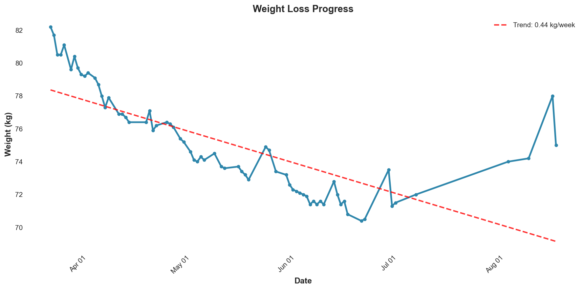
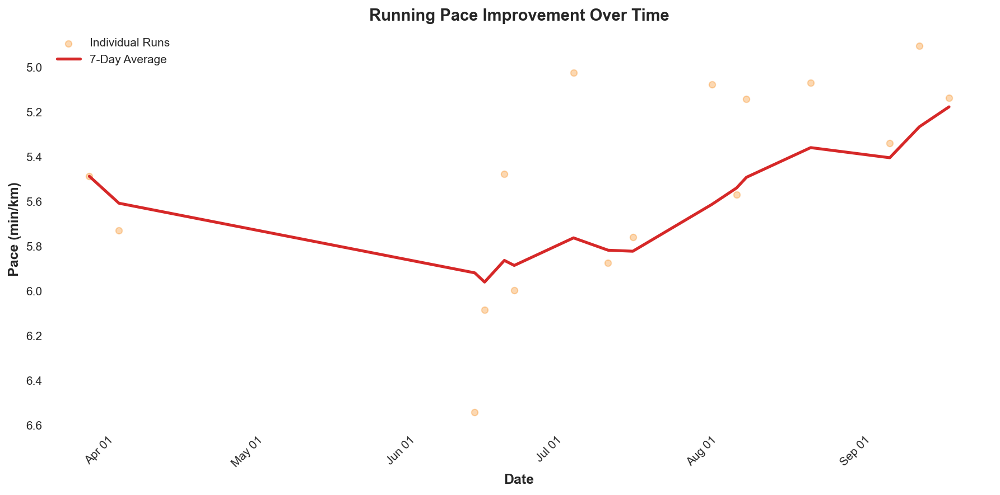
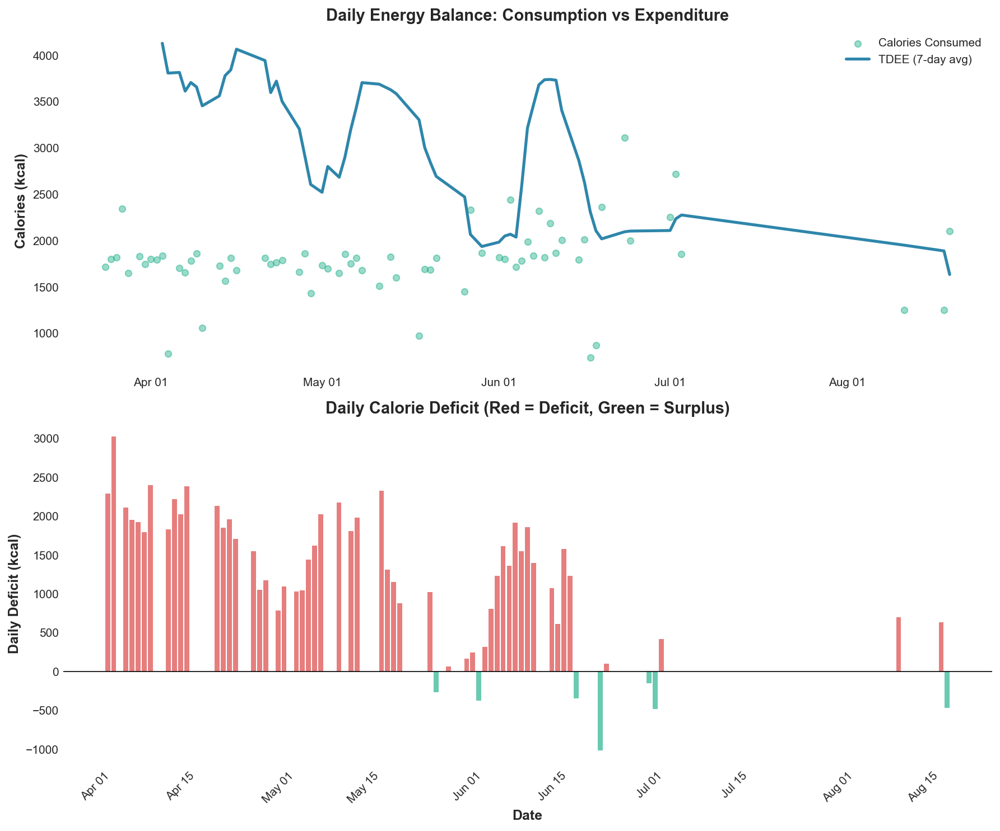
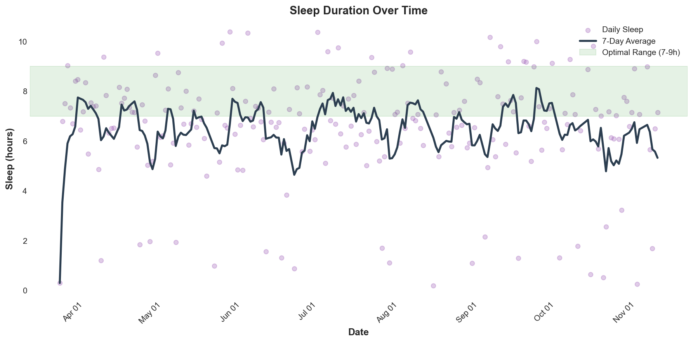
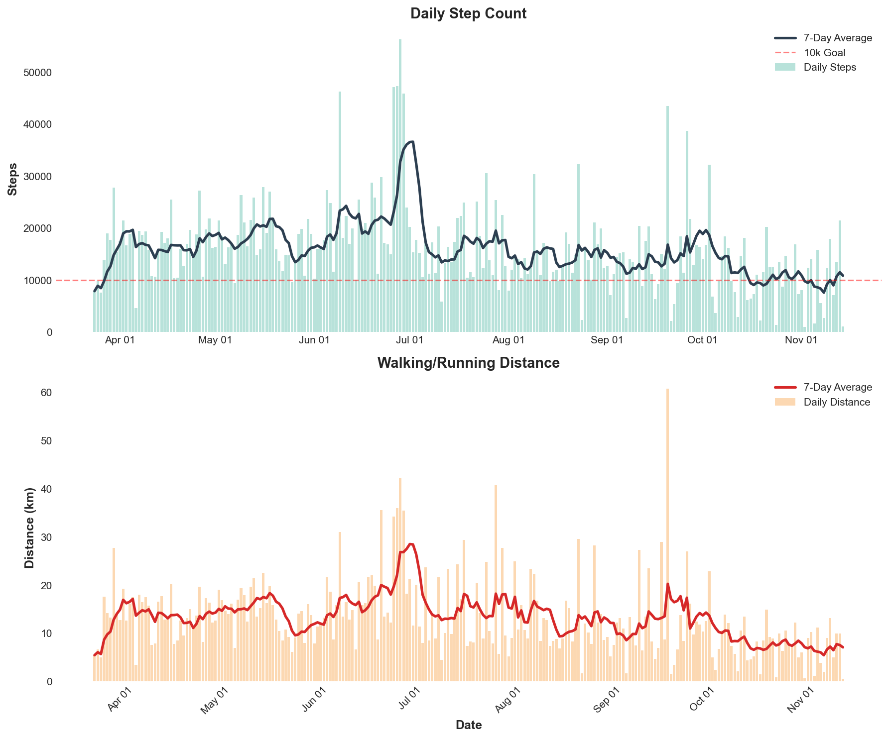

# Health Analyzer

A comprehensive health metrics analytics platform for Apple Watch and Apple Health data. Track weight loss, fitness improvements, sleep patterns, and more through an interactive dashboard and REST API.



## Key Results (March 24 - November 14, 2025)

- **Weight Loss:** 7.2 kg lost (82.2 kg → 75.0 kg)
- **Running Improvement:** Pace improved by 35 seconds/km (5.76 → 5.18 min/km)
- **Activity Level:** 16,057 average daily steps (83% of days >10k)
- **Energy Balance:** Maintained sustainable 1,163 kcal/day deficit
- **TDEE:** 2,941 kcal/day (calculated from actual weight changes)

📊 **[Read Full Analysis →](docs/ANALYSIS.md)**

---

## Features

### 1. Interactive Dashboard

Built with Plotly Dash, providing real-time visualizations across five comprehensive tabs:

- **Overview:** Data summary and key metrics
- **TDEE Analysis:** Weight tracking, calorie balance, energy expenditure
- **Running Performance:** Pace trends, cardiovascular fitness, VO2 max
- **Sleep & Recovery:** Sleep duration, recovery scores, optimization insights
- **Activity Patterns:** Step counts, consistency analysis, exercise trends

### 2. REST API for Automated Data Collection

- Receive health data from iOS apps automatically
- Idempotent storage with UUID-based deduplication
- Data lake architecture ("bronze layer")
- Support for continuous automated exports

### 3. Advanced Analytics

- **TDEE Calculation:** Energy balance equation using actual weight changes
- **Running Analysis:** Performance metrics, pace improvements, heart rate trends
- **Sleep Tracking:** Duration analysis with proper sleep stage filtering
- **Activity Monitoring:** Daily steps, distance, and consistency metrics

---

## Visual Results

### Weight Loss Progression


Steady, sustainable weight loss over 8 months with clear downward trend.

### Running Pace Improvement


10.1% improvement in running pace - 35 seconds faster per kilometer.

### TDEE & Calorie Balance


Energy balance analysis showing consistent deficit leading to weight loss.

### Sleep Patterns


Sleep duration tracking with 7-9 hour optimal range highlighted.

### Daily Activity


High activity levels with 83% of days exceeding 10,000 steps.
**Note:** Distance shown represents total daily walking + running (13.4 km avg), not just dedicated runs.

---

## Quick Start

### Prerequisites
- Python 3.8+
- pip

### Installation

```bash
# Install dependencies
pip install -r requirements.txt

# Start the dashboard
python run_dashboard.py
```

Open browser to: http://127.0.0.1:8050/

### Generate Analysis Charts

```bash
# Create all visualization charts
python scripts/generate_analysis_charts.py
```

Charts will be saved to the `docs/` folder.

---

## Project Structure

```
Healthanalyzer/
├── src/
│   ├── dashboard.py              # Interactive Plotly Dash dashboard
│   ├── data_loader.py            # Data loading and processing
│   ├── running_analysis.py       # Running performance analysis
│   ├── advanced_analysis.py      # Sleep, recovery, activity analysis
│   └── app.py                    # FastAPI REST API
├── scripts/
│   ├── generate_analysis_charts.py    # Create visualization charts
│   ├── parse_apple_export.py          # Parse Apple Health exports
│   └── process_bronze.py              # Convert bronze layer to CSV
├── data/processed/files/         # Processed CSV files
├── docs/
│   ├── ANALYSIS.md               # Comprehensive analysis document
│   ├── *.png                     # Generated charts
├── run_dashboard.py              # Dashboard launcher
├── run_api.py                    # API launcher
└── requirements.txt              # Python dependencies
```

---

## Data Processing

### Key Fixes Implemented

The system includes important data quality improvements:

1. **Duplicate Removal:** Automatically removes 697,000+ duplicate entries from CSV exports
2. **Date Filtering:** Analyzes only user-specified date range (March 24, 2025+)
3. **Sleep Calculation Fix:** Excludes "Awake" and "InBed" states, counting only actual sleep
4. **TDEE Accuracy:** Excludes zero-calorie tracking days for accurate calculations

### Tracked Metrics

**Body Metrics:** Weight, Height, BMI

**Energy:** Active Energy, Basal Energy, Dietary Energy (calories)

**Activity:** Steps, Distance, Flights Climbed, Exercise Time, Stand Time

**Cardiovascular:** Heart Rate, Resting HR, HRV, VO2 Max, Oxygen Saturation

**Running:** Speed, Power, Stride Length, Ground Contact Time, Vertical Oscillation

**Nutrition:** Macros (Protein, Carbs, Fat), Micros (Calcium, Iron, Magnesium, etc.)

**Sleep:** Sleep Analysis with proper stage filtering

**Other:** Respiratory Rate, Physical Effort, Environmental Audio Exposure

---

## TDEE Calculation Methodology

The system uses the energy balance equation to calculate Total Daily Energy Expenditure:

```
TDEE = Avg_Calories_In - (Weight_Change_kg × 7,700 kcal/kg) / Days
```

This method uses **actual observed weight changes** and calorie intake to reverse-engineer your true energy expenditure, providing more accurate results than formula-based estimates.

**Key Features:**
- 7-day rolling window for smoothing
- Confidence scoring based on weight change magnitude
- Outlier detection using IQR method
- Excludes days with missing or zero calorie tracking

---

## REST API Usage

### Start API Server

```bash
python run_api.py
```

API available at: `http://localhost:8000`

### Endpoints

- `GET /` - Health check
- `POST /ingest/health` - Ingest health data

### Authentication

Include API token in `.env` file:
```env
INGEST_TOKEN=your-secret-token
```

Send token via:
- Header: `Authorization: Bearer YOUR_TOKEN`
- Header: `X-API-Key: YOUR_TOKEN`
- Query parameter: `?key=YOUR_TOKEN`

### Example Request

```bash
curl -X POST http://localhost:8000/ingest/health \
  -H "Authorization: Bearer YOUR_TOKEN" \
  -H "Content-Type: application/json" \
  -d '{
    "type": "HKQuantityTypeIdentifierBodyMass",
    "samples": [{
      "start": "2025-11-14T08:00:00+00:00",
      "value": 75.0,
      "unit": "kg"
    }]
  }'
```

---

## Apple Health Data Export

### Manual Export

1. Open Health app on iPhone
2. Tap profile picture (top right)
3. Scroll down and tap "Export All Health Data"
4. Save and extract to project directory

### Automated Export (Recommended)

Configure iOS app to automatically export data to your REST API endpoint.

---

## Analysis Highlights

### Weight Loss Success Factors

- **Sustainable Rate:** 0.30 kg/week average (healthy range)
- **Consistent Deficit:** ~1,163 kcal/day without extreme restriction
- **High Activity:** 16,057 steps/day supporting elevated TDEE
- **Data-Driven:** Actual TDEE calculations guide nutrition decisions

### Running Performance Gains

- **10.1% Faster:** Pace improved from 5:46 to 5:11 min/km
- **Distance Impact:** 35 seconds faster per km = 12+ minutes on half marathon
- **Consistency:** Regular training without injury
- **Weight Benefit:** Reduced body weight improves biomechanical efficiency

### Areas for Improvement

1. **Sleep Duration:** Current 6.5 hours/night → Target 7-9 hours
2. **Tracking Consistency:** 34 days with zero calorie entries
3. **Recovery Monitoring:** Use HRV trends to optimize training load

---

## Advanced Features

### Sleep & Recovery Analysis
- Sleep stage tracking (Deep, REM, Core sleep only)
- Recovery score calculation
- Overtraining risk detection
- Sleep-performance correlation

### Activity Pattern Analysis
- Weekly/monthly consistency metrics
- Weekday vs weekend comparison
- Active days percentage
- Exercise time distribution

### Weight Loss Phase Detection
- Identifies rapid loss, steady loss, and maintenance phases
- Goal date prediction based on trends
- Weekly rate calculations

---

## Customization

### Update Analysis Periods

Edit `src/dashboard.py`:
```python
DATA_START_DATE = "2025-03-24"  # Your start date
```

### Personal Parameters

Update BMR calculation (in analysis scripts):
```python
bmr_estimate = calculate_bmr(
    weight_kg=latest_weight,
    age=25,              # Your age
    sex='male',          # 'male' or 'female'
    height_cm=175        # Your height
)
```

---

## Troubleshooting

### Dashboard Won't Start
- Check port 8050 is not in use
- Verify dependencies: `pip install -r requirements.txt`
- Check console for error messages

### No Data Showing
- Verify CSV files exist in `data/processed/files/`
- Check date ranges match your data
- Run `python scripts/generate_analysis_charts.py` to verify data

### API Not Receiving Data
- Verify API token in `.env` matches iOS app
- Check API is running: `curl http://localhost:8000`
- Ensure firewall allows port 8000

---

## Data Privacy

- All data stored locally
- No external server connections
- API accepts only configured connections
- Human-readable CSV storage format

---

## Performance

- Dashboard loads 236 days of data in seconds
- Handles 697,000+ deduplicated records
- Real-time visualization updates
- Concurrent API request support

---

## Built With

- **Python 3.13**
- **FastAPI** - REST API
- **Plotly Dash** - Interactive dashboard
- **Pandas & NumPy** - Data processing
- **SciPy** - Statistical analysis
- **Matplotlib** - Chart generation

---

## License

This project is provided as-is for personal use.

---

**Last Updated:** November 2025

📊 **[Read Full Analysis →](docs/ANALYSIS.md)**
